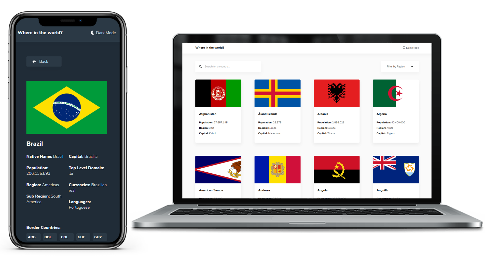

<h1 align="center">

<br>
Rest countries challenge
</h1>

<p align="center">Desafio do site <a href="https://www.frontendmentor.io/challenges/rest-countries-api-with-color-theme-switcher-5cacc469fec04111f7b848ca" target="_blank">Frontendmentor</a> no frontend que consiste em recriar o visual sugerido de uma aplicação que lista países e suas informações.</p>

# 📋 Índice

- [Telas](#-Telas)
- [Sobre o projeto](#-Sobre-o-projeto)
  - [O desafio](#-O-desafio)
  - [Funcionalidades](#-Funcionalidades)
- [Tecnologias utilizadas](#-Tecnologias-utilizadas)
- [Rodando o projeto](#-Rodando-o-projeto)
  - [Pré-requisitos](#-Pré-requisitos)
  - [Rodando a aplicação](#-Rodando-a-aplicação)

## 📃 Sobre o projeto

Este projeto foi feito baseado em um dos desafios propostos pelo site Frontend Mentor. O desafio consiste em criar uma aplicação que consome a api REST countries e exibe dados de países como moeda utilizada, idiomas e países vizinhos.

### 🚩 O desafio

Integrar a API sugerida e mostrar dados dos países como proposto nos designs.

A aplicação pode ser desenvolvida utilizando um framework/bilioteca front-end como React ou Vue.

Link do desafio: https://www.frontendmentor.io/challenges/rest-countries-api-with-color-theme-switcher-5cacc469fec04111f7b848ca

### ⚙ Funcionalidades

- Ver todos os países deponíveis na página inicial
- Procurar por países
- Filtrar países por continente
- Ver mais informações de um país clicando sobre seu card
- Ver mais informações sobre países vizinhos
- Alterar entre modos escuro e claro

## 🛠 Tecnologias utilizadas

- ⚛️ **React** — Single page application
- 💅 **Styled components** — Estilização dos componentes
- 📡 **Axios** — Requisições a API

## 🚀 Rodando o projeto

### Pré-requisitos

- Git
- NodeJS
- Yarn

### 🖥 Rodando a aplicação

Clone o repositório

```bash

# Clona o repositório
git clone https://github.com/thiagosprestes/rest-countries-challenge.git

```

Navegue até a pasta do projeto clonado e execute o comando abaixo

```bash

# Instala as dependências
yarn

# Inicia a aplicação
yarn start

# Acesse http://localhost:3000 para utilizar a aplicação

```
